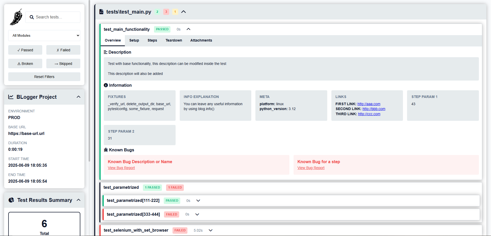
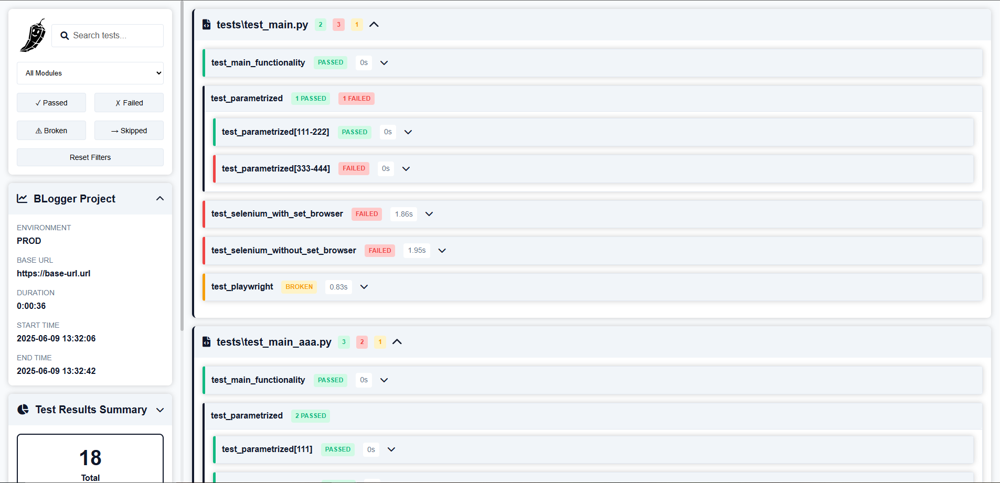

# BLogger — Pytest Logging Plugin

---

## Overview

BLogger is a Pytest plugin for enhanced test logging and generating convenient and lightweight reports.  
It supports structured test steps, descriptions, info notes, known bugs, and automatic screenshots.  
Works seamlessly with Selenium WebDriver and Playwright Page instances. \
Integrates with Allure and Qase for fewer duplicates like .steps, .attach etc.

### Features

- Set global **base URL**, **environment**, and **browser** instance (Selenium or Playwright).  
- Add/update **test descriptions** dynamically.
- Log any important **info** during tests or steps.  
- Mark tests/steps with **known bugs** and optional bug tracker URLs.
- **Print** messages attached to current step (supports multiline and complex data).  
- Take and attach **screenshots** automatically on demand or on errors.  
- **Attach** files or arbitrary data to steps.

### Report Examples
#### blog_report.html



## Installation

```bash
pip install pytest-b-logger
```

## Setup
Add **blog.config.yaml** file to the root of your project.\
Bare minimum for everything to work: 
```yaml
project_name: "Project Name"
```
You can also add env and base url here:
```yaml
project_name: "Project Name"

env: "prod"
base_url: 'https://base-url.com'
```
By default, integrations are turned off.\
If you are using Allure and want steps, info, description etc. to be duplicated to Allure, simply add integrations block:
```yaml
project_name: "Project Name"

env: "prod"
base_url: 'https://base-url.com'

integrations:
  allure: True
```

## Documentation on Methods

```python
import pytest
from contextlib import contextmanager

from b_logger.entities.steps import Step
from b_logger.entities.exceptions import possible_exceptions
from b_logger.integrations import Integrations
from b_logger.plugin import runtime


class BLogger:

    @staticmethod
    def set_base_url(base_url: str):
        """
        Set base_url for the entire Run

            Can also be added in blog.config.yaml:
                base_url: 'https://base-url.com'

            Or via command line options:
                --blog_base_url 'https://base-url.com'
        """
        runtime.set_base_url(base_url)

    @staticmethod
    def set_env(env: str):
        """
        Set env for the entire Run

            Can also be added in blog.config.yaml:
                env: 'prod'

            Or via command line options:
                --blog_env 'prod'
        """
        runtime.set_env(env)

    @staticmethod
    def set_browser(browser: "RemoteWebDriver | WebDriver | Page"):
        """
        Set browser in a browser init fixture or in a test

        If browser init fixture name is in
            ["driver", "page", "selenium_driver", "driver_init", "playwright_page"]
        then it will be detected automatically

        Usage:
            @pytest.fixture()
            def selenium_driver():
                driver = webdriver.Chrome()

                blog.set_browser(driver)

                yield driver

                driver.quit()

            or

            def test_playwright(page): <-- Will be detected automatically
                page.goto(f'https://google.com')
        """
        runtime.set_browser(browser)

    @staticmethod
    def description(description: str):
        """
        Add Test Description
            Can be used as marker @blog.description() as well as function blog.description()
            Usage inside a test expands description inside marker

        Usage:
            @blog.description(
                'Test with base functionality, '
                'this description can be modified inside the test'
            )
            def test_main_functionality():
                blog.description('This description will also be added')
        """
        runtime.apply_description(description)

        return pytest.mark.blog_description(description=description)

    @staticmethod
    def info(**kwargs):
        """
        Leave any info or note about Test or Step
            Can be used as marker @blog.info(k=v) as well as function blog.info(k=v)

            k is a name of an info block
            v supports any data type, but {} is most readable and convenient

            Any amount of info blocks is allowed: @blog.info(k=v, k=v, k=v, ...)

        Usage:
            @blog.info(                             <-- Will be added for a Test
                meta={'platform': 'linux', 'python_version': 3.12}
                additional_parameters=['param 1', 'param 2'],
                some_info='some info',
            )
            def test_main_functionality():
                blog.info(a='a')                    <-- Will be added for a Test

                with blog.step('Step 1'):
                    blog.info(                      <-- Will be added for a Step
                        step_1_info={'b': 2, 'c': 3}
                    )
        """
        runtime.apply_info(**kwargs)

        return pytest.mark.blog_info(kwargs=kwargs)

    @staticmethod
    def link(**kwargs):
        """
        Attach links to Test or Step
            Can be used as marker @blog.link(k=v) as well as function blog.link(k=v)

            k is a name of a link
            v is a URL

            Any amount of links is allowed: @blog.link(k=v, k=v, k=v, ...)

        Usage:
            @blog.link(
                first_link='http://aaa.com',
                second_link='http://bbb.com'
            )
            def test_main_functionality():
                blog.link(third_link='http://ccc.com')
        """
        runtime.apply_link(**kwargs)

        return pytest.mark.blog_link(kwargs=kwargs)

    @staticmethod
    def known_bug(description: str, url: str = None):
        """
        Add known bug for Test or Step

        Usage:
            @blog.known_bug(                            <-- Will be added for a Test
                'Test Bug 1',
                'https://link-to-your-bug/1.com'
            )
            def test_main_functionality():
                blog.known_bug(                         <-- Will be added for a Test
                    'Test Bug 2',
                    'https://link-to-your-bug/2.com'
                )

                with blog.step('Step Title'):           <-- Will be added for a Test and a Step
                    blog.known_bug(
                        'Step Bug',
                        'https://link-to-your-bug/3.com'
                    )
        """
        runtime.apply_known_bug(description, url)

        return pytest.mark.blog_known_bug(description=description, url=url)

    @staticmethod
    @contextmanager
    def step(title: str, expected: str = None):
        """
        Usage:
            with blog.step('Step Title', 'Expected Result'):
                pass
        """
        with Integrations.step(title, expected):

            step = Step(title=title, expected=expected)

            runtime.start_step(step)

            try:
                yield
                runtime.handle_step_result(step)

            except possible_exceptions as e:
                runtime.handle_step_result(step, e)
                raise e

            finally:
                runtime.finish_step(step)

    @staticmethod
    def print(data):
        """
        Print any message (str, dict, list, object, etc.)
            It will be added to a Current Step as SubStep
            Newlines with \n are supported

        Usage:
            data = {"a": 1, "b": 2}
            blog.print(f'Some important data: {data}')

            blog.print(f'Probably too long str\n'
                        'can be newlined like that')
        """
        runtime.print_message(data)

    @staticmethod
    def screenshot(name: str = None, is_error: bool = False):
        """
        Make screenshot
            It will be automatically attached to Test Run and Current Step
            Will do nothing if no browser is used

        Usage:
            blog.screenshot('scr_name')
            blog.screenshot('err_scr_name', True)
        """
        runtime.make_screenshot(name, is_error)

    @staticmethod
    def attach(source, name: str = None):
        """
        Attach file or screenshot
            It will be added to Test Run and Current Step

        Usage:
            blog.attach({"a": 1, "b": 2}, 'some_data')
        """
        runtime.attach(source, name)
```

## Usage examples

You may just read through this test file and understand common usage.\
More detailed info can be found in "Documentation on Methods" block below

```python
import pytest
import random
from pytest_playwright.pytest_playwright import Playwright
from selenium import webdriver

from b_logger import blog

blog.set_env('prod')

blog.set_base_url('https://base-url.url')


@pytest.fixture()
def some_fixture():
    with blog.step('aaa'):
        pass

    yield

    with blog.step('bbb'):
        pass


@blog.description(
    'Test with base functionality, '
    'this description can be modified inside the test'
)
@blog.info(
    info_explanation='You can leave any useful information by using blog.info()',
    meta={'platform': 'linux', 'python_version': 3.12}
)
@blog.link(
    first_link='http://aaa.com',
    second_link='http://bbb.com'
)
@blog.known_bug(
    'Known Bug Description or Name',
    'https://link-to-your-bug/1.com'
)
def test_main_functionality(some_fixture):
    blog.description('This description will also be added')

    with blog.step('Step 1'):
        data = {"a": 1, "b": 2}
        blog.print(f'Some data: \n{data}')

        blog.link(third_link='http://ccc.com')

        with blog.step('Step 1.1'):
            step_param_1 = random.randint(1, 100)
            step_param_2 = random.randint(1, 100)

            blog.info(
                step_param_1=step_param_1,
                step_param_2=step_param_2
            )

    with blog.step('Step 2'):
        blog.known_bug('Known Bug for a step', 'https://link-to-your-bug/2.com')

        with blog.step('Step 2.1'):
            pass

            with blog.step('Step 2.11'):
                pass

                with blog.step('Step 2.111'):
                    pass

                    with blog.step('Step 2.1111'):
                        pass


@pytest.mark.parametrize('py_param_1, py_param_2', [(111, 222), (333, 444)])  # <-- These parameters will be added to test automatically
def test_parametrized(py_param_1, py_param_2):
    with blog.step('step 1'):
        with blog.step('step 2'):
            with blog.step('step 3'):
                blog.print(py_param_1)
                with blog.step('step 4'):
                    blog.print(py_param_2)
                assert py_param_1 in [111, 444]


@pytest.fixture()
def selenium_driver():
    chrome_options = webdriver.ChromeOptions()
    chrome_options.add_argument('--headless=new')

    driver = webdriver.Chrome(options=chrome_options)

    driver.set_window_size(1920, 1080)

    # blog.set_browser(driver) can be also added here, which is preferred

    yield driver

    driver.quit()


# @pytest.mark.xfail
@blog.description('This test will make browser screenshot as we did blog.set_browser. '
                  'We can also do it in "selenium_driver" fixture')
@blog.info(run_requirement='To run this test you\'ll need to download chromedriver and put it in your python folder')
def test_selenium_with_set_browser(selenium_driver):
    blog.set_browser(selenium_driver)

    with blog.step('Open any URL'):
        selenium_driver.get(f'https://google.com')

        with blog.step('Raise fake error to check error screenshot'):
            assert 1 == 2


# @pytest.mark.xfail
@blog.description('This test will also make browser screenshot as it '
                  'found driver automatically '
                  'based on the following possible browser instance fixture names: '
                  '["driver", "page", "selenium_driver", "driver_init", "playwright_page"]')
def test_selenium_without_set_browser(selenium_driver):  #  <-- Will be detected automatically

    blog.info(run_requirement='To run this test you\'ll need to download chromedriver and put it in your python folder')

    with blog.step('Open any URL'):
        selenium_driver.get(f'https://google.com')

        with blog.step('Raise fake error to check error screenshot'):
            assert 1 == 2


@pytest.fixture()
def playwright_page(playwright: Playwright):
    browser = playwright.chromium.launch(headless=True)

    context = browser.new_context()

    page = context.new_page()
    page.set_viewport_size({"width": 1920, "height": 1080})

    # blog.set_browser(page) can also be added here, which is preferred

    yield page

    browser.close()


# @pytest.mark.xfail
def test_playwright(playwright_page):  #  <-- Will be detected automatically
    with blog.step('Open any URL'):
        playwright_page.goto(f'https://google.com')

        with blog.step('Raise fake error to check error screenshot'):
            print(empty_variable)

```

## Publishing to CI/CD
### Jenkins
To post results to Jenkins you could simply use the HTMLpublisher utility and the following command:
```
publishHTML([
    reportName: 'BLog Report',
    reportDir: 'b_logs',
    reportFiles: 'blog_report.html',
    icon: 'static/icon.svg',
    allowMissing: false,
    keepAll: true,
    alwaysLinkToLastBuild: true
])
```
However, you may face the problem of CSP (Content Security Policy) blocking .js and .css.\
In order not to affect CSP you can set up Resource Root URL: https://www.jenkins.io/doc/book/security/user-content/#resource-root-url