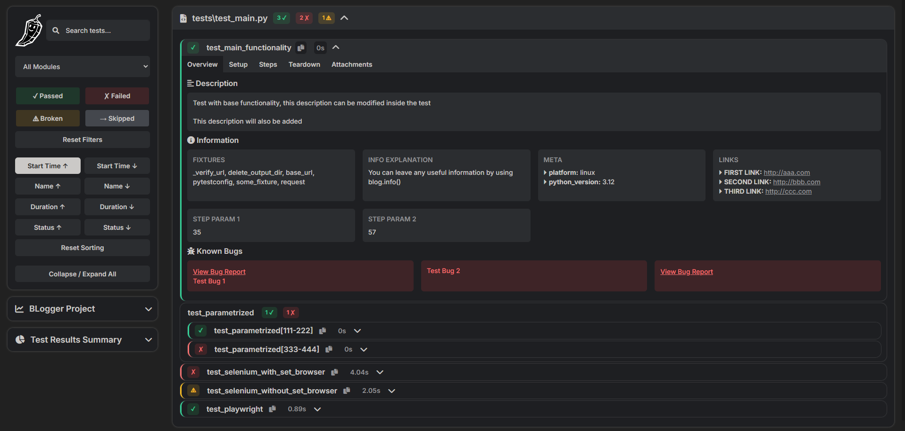

# BLogger — Pytest Logging Plugin

[Switch to RU version of README.md](README_ru.md)

- [Overview](#overview)
- [Report Examples](#report-examples)
- [Installation](#installation)
- [Setup](#setup)
  - [Project Name](#project_name)
  - [Time Zone](#timezone)
  - [Integrations](#integrations)
  - [Hide Passwords](#hide_passwords)
  - [Env and Base URL](#env-and-base_url)
- [BLogger API](#blogger-api)
  - [Set Base URL](#set-base-url)
  - [Set Env](#set-env)
  - [Set Browser](#set-browser)
  - [Description](#description)
  - [Info](#info)
  - [Link](#link)
  - [Known Bug](#known-bug)
  - [Step](#step)
  - [Print](#print)
  - [Screenshot](#screenshot)
  - [Attach](#attach)
- [Publishing to CI/CD](#publishing-to-cicd)
  - [Jenkins](#jenkins)
- [Useful Features](#useful-features)
  - [Notes](#notes)
  - [Search, Filters and Sorting](#search-filters-and-sorting)
  - [Compare Retries](#compare-retries)
  - [Automatic Error Screenshots](#automatic-error-screenshots)
---


## Overview

BLogger is a Pytest plugin for enhanced test logging and generating convenient and lightweight reports.  
It supports structured test steps, descriptions, info notes, known bugs, and automatic screenshots.  
Works seamlessly with Selenium WebDriver and Playwright Page instances. \
Integrates with Allure and Qase for fewer duplicates like .steps, .attach etc.

---


## Report Examples

### b_logs
[Download sample_b_logs.zip](readme_content/sample_b_logs.zip)

### blog_report.html
Click on main icon (pepper) to switch themes




### blog_summary.html


---


## Installation

```bash
pip install pytest-b-logger
```
---


## Setup
!!! Add ***blog.config.yaml*** file to the ***root*** of your project. !!!

### project_name
Bare minimum for everything to work is project_name: 
```yaml
project_name: 'Project Name'
```
Can be changed later via CLI when running tests
```bash
pytest --blog-project-name '...'
```


### timezone
Then you can set the desired Time Zone (IANA format e.g. Europe/Moscow, UTC, America/New_York).\
The list of available timezones: https://en.wikipedia.org/wiki/List_of_tz_database_time_zones


```yaml
project_name: 'Project Name'

tz: 'Europe/Moscow'
```


### integrations
By default, integrations are turned off. \
If you are using Allure and want steps, info, description etc. to be duplicated to Allure, 
simply add integrations block and set ***integrations: allure: True***
```yaml
project_name: 'Project Name'

tz: 'Europe/Moscow'

integrations:
  allure: True
```


### hide_passwords
By default, passwords inside parameters are hidden.


If you want passwords to be shown simply set ***hide_passwords: False***
```yaml
project_name: 'Project Name'

tz: 'Europe/Moscow'

integrations:
  allure: True

hide_passwords: False
```


### env and base_url
You can add env and base url here.
```yaml
project_name: 'Project Name'

tz: 'Europe/Moscow'

integrations:
  allure: True

hide_passwords: True

env: 'prod' # optional
base_url: 'https://base-url.com' # optional
```
Which, could also be passed as command line options on test run, e.g. when using CI/CD:
```bash
pytest --blog-env 'prod' --blog-base-url 'https://base-url.com'
```

***!!! Note !!!*** Options apply in the following order: blog.config.yaml > Command Line Arguments > blog methods inside code

Now you are all set up. \
Simply run pytest and ***b_logs*** folder will be generated 
with ***blog_report.html*** and ***blog_summary.html*** \
For more advanced usage please review ***[BLogger API](#blogger-api)***
---


## BLogger API


### Set Base URL
`blog.set_base_url(base_url: str)`

Set `base_url` for the entire Run
```python
from b_logger import blog

blog.set_base_url('https://base-url.com')
```

Can also be added in blog.config.yaml:
```yaml
base_url: 'https://base-url.com'
```

Or via command line options:
```bash
pytest --blog-base-url 'https://base-url.com'
```
---


### Set Env
`blog.set_env(env: str)`

Set `env` for the entire Run

```python
from b_logger import blog

blog.set_env('env')
```

Can also be added in blog.config.yaml:
```yaml
env: 'prod'
```

Or via command line options:
```bash
pytest --blog_env 'prod'
```
---


### Set Browser
`set_browser(browser: "RemoteWebDriver | WebDriver | Page")`

Set browser in a browser init fixture or in a test

If browser init fixture name is "driver", "page", "selenium_driver", "driver_init", "playwright_page"
then it will be detected and applied automatically.\
If browser is set it will also automatically make error screenshots on test fails and attach them to current step and error info.

```python
import pytest
from selenium import webdriver
from b_logger import blog

@pytest.fixture()
def selenium_driver():
    driver = webdriver.Chrome()

    blog.set_browser(driver)  # <-- Manual browser instance setup

    yield driver

    driver.quit()
```
or
```python
def test_playwright(page):  # <-- Will be detected automatically
    ...
```
---


### Description
`description(description: str)`

Add Test Description\
Will be added to the Overview Tab

Can be used as marker @blog.description() as well as function blog.description()\
Usage inside a test expands description inside marker
```python
from b_logger import blog

@blog.description(
    'Test with base functionality, '
    'this description can be modified inside the test'
)
def test_main_functionality():
    blog.description('This description will also be added')
```
---


### Info
`info(**kwargs)`

Leave any important info or note about Test or Step\
Will be added to the Overview Tab and Current Step

Can be used as marker @blog.info(k=v) as well as function blog.info(k=v)\

k: name of an info block \
v: supports any data type, but {} is most readable and convenient

Any amount of info blocks is allowed: @blog.info(k=v, k=v, k=v, ...)

```python
from b_logger import blog

@blog.info(
    meta={'platform': 'linux', 'python_version': 3.12},
    additional_parameters=['param 1', 'param 2'],
    some_info='some info'
)
def test_main_functionality():
    blog.info(a='a')
    
    with blog.step('Step 1'):
        blog.info(
            step_1_info={'b': 2, 'c': 3}
        )
```
---


### Link
`link(**kwargs)`

Attach links to Test or Step\
Will be added to the Overview Tab and Current Step

Can be used as marker @blog.link(k=v) as well as function blog.link(k=v)

k is a name of a link\
v is a URL

Any amount of links is allowed: @blog.link(k=v, k=v, k=v, ...)

```python
from b_logger import blog

@blog.link(
    first_link='http://aaa.com',
    second_link='http://bbb.com'
)
def test_main_functionality():
    blog.link(third_link='http://ccc.com')
```
---


### Known Bug
`known_bug(url: str, description: str)`

Add known bug for Test or Step. \
Will be added to the Overview Tab and Current Step

```python
from b_logger import blog

@blog.known_bug(
    'https://link-to-your-bug/1.com',
    'Test Bug 1'
)
def test_main_functionality():
    blog.known_bug(description='Test Bug 2')

    with blog.step('Step Title'):
        blog.known_bug('https://link-to-your-bug/3.com')
```
---


### Step
`step(title: str, expected: str = None)`

Wrap a code block into a Step. \
Will be displayed in Setup, Steps and Teardown blocks depending on a test stage.

Info, Known Bugs, Links, Screenshots, Prints, Attachments will be added to a current step if made inside a step context.

```python
from b_logger import blog

with blog.step('Step Title', 'Expected Result'):
    ...
```
---


### Print
`print(data)`

Print any message (str, dict, list, object, etc.)\
Will be added to a Current Step and stdout.txt

```python
from b_logger import blog

data = {"a": 1, "b": 2}
blog.print(f'Some important data: {data}')

blog.print(f'Probably too long str\n'
            'can be newlined like that')
```
---


### Screenshot
`screenshot(name: str = None, is_error: bool = False)`

Make screenshot

Will be added to the Attachments Tab and Current Step \
Will do nothing if no browser is used

is_error flag adds "err_scr_" prefix to a scr name

```python
from b_logger import blog

blog.screenshot('scr_name')
blog.screenshot('err_scr_name', True)
```
---


### Attach
`attach(content: Union[bytes, Path, BinaryIO, str, dict, list, int, float, bool, None], name: str = None)`

Attach file or data\
Will be added to the Attachments Tab and Current Step

Add extension to file name to save as a particular type. Example: 'excel_file.xlsx'

```python
from b_logger import blog
from pathlib import Path

blog.attach({"a": 1, "b": 2}, 'some_data')
blog.attach(Path('path/to/your/file.ext'))
blog.attach(excel_data, 'excel_file.xlsx')
```
---


## Usage examples


## Publishing to CI/CD
### Jenkins
To post results to Jenkins you could simply use the HTMLpublisher utility.

Add the following command to ***pipeline script*** or ***Jenkinsfile***:
```
publishHTML([
    reportName: 'BLog Report',
    reportDir: 'b_logs',
    reportFiles: 'blog_report.html',
    icon: 'static/icon.svg',
    allowMissing: false,
    keepAll: true,
    alwaysLinkToLastBuild: true
])
```
However, you may face the problem of CSP (Content Security Policy) blocking .js and .css.\
In order not to affect CSP you can set up Resource Root URL: https://www.jenkins.io/doc/book/security/user-content/#resource-root-url

BLog Report then will be available via `https://jenkins.../job/.../BLog_20Report/`

Also, you can store b_logs as artifact for the build:
```
archiveArtifacts artifacts: 'b_logs/**', fingerprint: true, allowEmptyArchive: true
zip zipFile: 'b_logs.zip', archive: true, dir: 'b_logs/'
```
---


## Useful Features

### Notes
Add ***blog.notes.yaml*** to the ***root*** of your project 

You can add ***style*** block if you want notes to be formatted in blog_summary.html. \
Inside simple css styles like color and font-size
```yaml
style: # optional
  color: red
  font-size: 20px

notes:
  - 'Here you can add any useful info about project'
  - 'For example floating bugs or specifications'
  - 'These notes will appear in blog_report.html and blog_summary.html'
```
This ***blog.notes.yaml*** will result in

blog_summary.html


blog_report.html

___


### Search, Filters and Sorting

___


### Compare Retries

___


### Automatic Error Screenshots


___