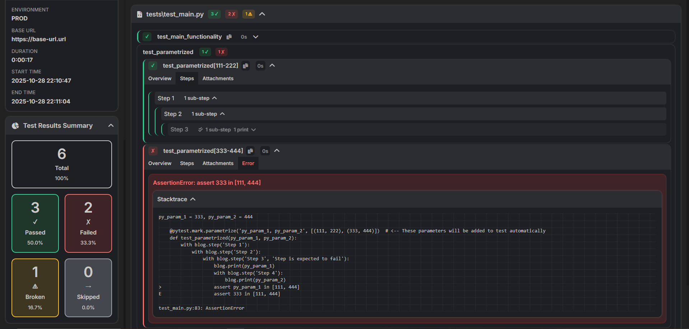

# BLogger — Pytest Logging Plugin

## Overview

BLogger is a Pytest plugin for enhanced test logging and generating convenient and lightweight reports.  
It supports structured test steps, descriptions, info notes, known bugs, and automatic screenshots.  
Works seamlessly with Selenium WebDriver and Playwright Page instances. \
Integrates with Allure and Qase for fewer duplicates like .steps, .attach etc.

## Features

- Set global **base URL**, **environment**, and **browser** instance (Selenium or Playwright).  
- Add/update **test descriptions** dynamically.
- Log any important **info** during tests or steps.  
- Mark tests/steps with **known bugs** and optional bug tracker URLs.
- **Print** messages attached to current step (supports multiline and complex data).  
- Take and attach **screenshots** automatically on demand or on errors.  
- **Attach** files or arbitrary data to steps.

## Report Examples
### Sample Report
[Download sample_b_logs.zip](readme_content/sample_b_logs.zip)
### blog_report.html



### blog_summary.html


## Installation

```bash
pip install pytest-b-logger
```


## Setup
Add **blog.config.yaml** file to the root of your project.\
Bare minimum for everything to work: 
```yaml
project_name: "Project Name"
```
You can also add env and base url here:
```yaml
project_name: "Project Name"

env: "prod"
base_url: 'https://base-url.com'
```
By default, integrations are turned off.\
If you are using Allure and want steps, info, description etc. to be duplicated to Allure, simply add integrations block:
```yaml
project_name: "Project Name"

env: "prod"
base_url: 'https://base-url.com'

integrations:
  allure: True
```


## BLogger API Reference

### Set Base URL
`blog.set_base_url(base_url: str)`

Set `base_url` for the entire Run

```python
from b_logger import blog

blog.set_base_url('https://base-url.com')
```

Can also be added in blog.config.yaml:
```yaml
base_url: 'https://base-url.com'
```

Or via command line options:
```bash
pytest --blog_base_url "https://base-url.com"
```
---


### Set Env
`blog.set_env(env: str)`

Set `env` for the entire Run

```python
from b_logger import blog

blog.set_env('env')
```

Can also be added in blog.config.yaml:
```yaml
env: 'prod'
```

Or via command line options:
```bash
pytest --blog_env 'prod'
```
---


### Set Browser
`set_browser(browser: "RemoteWebDriver | WebDriver | Page")`

Set browser in a browser init fixture or in a test

If browser init fixture name is "driver", "page", "selenium_driver", "driver_init", "playwright_page"
then it will be detected and applied automatically.\
If browser is set it will also automatically make error screenshots on test fails and attach them to current step and error info.

```python
import pytest
from selenium import webdriver
from b_logger import blog

@pytest.fixture()
def selenium_driver():
    driver = webdriver.Chrome()

    blog.set_browser(driver)  # <-- Manual browser instance setup

    yield driver

    driver.quit()
```
or
```python
def test_playwright(page):  # <-- Will be detected automatically
    ...
```
---


### Description
`description(description: str)`

Add Test Description\
Will be added to the Overview Tab

Can be used as marker @blog.description() as well as function blog.description()\
Usage inside a test expands description inside marker
```python
from b_logger import blog

@blog.description(
    'Test with base functionality, '
    'this description can be modified inside the test'
)
def test_main_functionality():
    blog.description('This description will also be added')
```
---


### Info
`info(**kwargs)`

Leave any important info or note about Test or Step\
Will be added to the Overview Tab and Current Step

Can be used as marker @blog.info(k=v) as well as function blog.info(k=v)\

k is a name of an info block\
v supports any data type, but {} is most readable and convenient

Any amount of info blocks is allowed: @blog.info(k=v, k=v, k=v, ...)

```python
from b_logger import blog

@blog.info(
    meta={'platform': 'linux', 'python_version': 3.12},
    additional_parameters=['param 1', 'param 2'],
    some_info='some info'
)
def test_main_functionality():
    blog.info(a='a')
    
    with blog.step('Step 1'):
        blog.info(
            step_1_info={'b': 2, 'c': 3}
        )
```
---


### Link
`link(**kwargs)`

Attach links to Test or Step\
Will be added to the Overview Tab and Current Step

Can be used as marker @blog.link(k=v) as well as function blog.link(k=v)

k is a name of a link\
v is a URL

Any amount of links is allowed: @blog.link(k=v, k=v, k=v, ...)

```python
from b_logger import blog

@blog.link(
    first_link='http://aaa.com',
    second_link='http://bbb.com'
)
def test_main_functionality():
    blog.link(third_link='http://ccc.com')
```
---


### Known Bug
`known_bug(url: str, description: str)`

Add known bug for Test or Step
Will be added to the Overview Tab and Current Step

```python
from b_logger import blog

@blog.known_bug(
    'https://link-to-your-bug/1.com',
    'Test Bug 1'
)
def test_main_functionality():
    blog.known_bug(description='Test Bug 2')

    with blog.step('Step Title'):
        blog.known_bug('https://link-to-your-bug/3.com')
```
---


### Step
`step(title: str, expected: str = None)`

Wrap a code block into a step. \
Will be displayed in Setup, Steps and Teardown blocks depending on a test stage.

Info, Known Bugs, Links, Screenshots, Prints, Attachments will be added to a current step if made inside a step context.

```python
from b_logger import blog

with blog.step('Step Title', 'Expected Result'):
    ...
```
---


### Print
`print(data)`

Print any message (str, dict, list, object, etc.)\
Will be added to a Current Step and stdout.txt

```python
from b_logger import blog

data = {"a": 1, "b": 2}
blog.print(f'Some important data: {data}')

blog.print(f'Probably too long str\n'
            'can be newlined like that')
```
---


### Screenshot 
`screenshot(name: str = None, is_error: bool = False)`

Make screenshot

Will be added to the Attachments Tab and Current Step \
Will do nothing if no browser is used

is_error flag adds "err_scr_" pre fix to a scr name

```python
from b_logger import blog

blog.screenshot('scr_name')
blog.screenshot('err_scr_name', True)
```
---


### Attach 
`attach(content: Union[bytes, Path, BinaryIO, str, dict, list, int, float, bool, None], name: str = None)`

Attach file or data\
Will be added to the Attachments Tab and Current Step

```python
from b_logger import blog
from pathlib import Path

blog.attach({"a": 1, "b": 2}, 'some_data')
blog.attach(Path('path_to_your_file'))
blog.attach('Any text')
```


## Usage examples

You may just read through this test file and understand common usage.

```python
import pytest
import random
from pytest_playwright.pytest_playwright import Playwright
from selenium import webdriver

from b_logger import blog

blog.set_env('prod')

blog.set_base_url('https://base-url.url')


@pytest.fixture()
def some_fixture():
    with blog.step('aaa'):
        pass

    yield

    with blog.step('bbb'):
        pass


@blog.description(
    'Test with base functionality, '
    'this description can be modified inside the test'
)
@blog.info(
    info_explanation='You can leave any useful information by using blog.info()',
    meta={'platform': 'linux', 'python_version': 3.12}
)
@blog.link(
    first_link='http://aaa.com',
    second_link='http://bbb.com'
)
@blog.known_bug(
    'Known Bug Description or Name',
    'https://link-to-your-bug/1.com'
)
def test_main_functionality(some_fixture):
    blog.description('This description will also be added')

    with blog.step('Step 1', 'Step is expected to pass'):
        data = {"a": 1, "b": 2}
        blog.print(f'Some data: {data}')

        blog.link(third_link='http://ccc.com')

        with blog.step('Step 1.1'):
            step_param_1 = random.randint(1, 100)
            step_param_2 = random.randint(1, 100)

            blog.info(
                step_param_1=step_param_1,
                step_param_2=step_param_2
            )

    with blog.step('Step 2'):
        blog.known_bug('Known Bug for a step', 'https://link-to-your-bug/2.com')

        with blog.step('Step 2.1'):
            pass

            with blog.step('Step 2.11'):
                pass

                with blog.step('Step 2.111'):
                    pass

                    with blog.step('Step 2.1111'):
                        pass


@pytest.mark.parametrize('py_param_1, py_param_2', [(111, 222), (333, 444)])  # <-- These parameters will be added to test automatically
def test_parametrized(py_param_1, py_param_2):
    with blog.step('Step 1'):
        with blog.step('Step 2'):
            with blog.step('Step 3', 'Step is expected to fail'):
                blog.print(py_param_1)
                with blog.step('Step 4'):
                    blog.print(py_param_2)
                assert py_param_1 in [111, 444]


@pytest.fixture()
def selenium_driver():
    chrome_options = webdriver.ChromeOptions()
    chrome_options.add_argument('--headless=new')

    driver = webdriver.Chrome(options=chrome_options)

    driver.set_window_size(1920, 1080)

    # blog.set_browser(driver) can be also added here, which is preferred

    yield driver

    driver.quit()


@blog.description('This test will make browser screenshot as we did blog.set_browser. '
                  'We can also do it in "selenium_driver" fixture')
@blog.info(run_requirement='To run this test you\'ll need to download chromedriver and put it in your python folder')
def test_selenium_with_set_browser(selenium_driver):
    blog.set_browser(selenium_driver)

    with blog.step('Open any URL'):
        selenium_driver.get(f'https://google.com')

        with blog.step('Raise fake error to check error screenshot'):
            assert 1 == 2


@blog.description('This test will also make browser screenshot as it '
                  'found driver automatically '
                  'based on the following possible browser instance fixture names: '
                  '["driver", "page", "selenium_driver", "driver_init", "playwright_page"]')
def test_selenium_without_set_browser(selenium_driver):  #  <-- Will be detected automatically

    blog.info(run_requirement='To run this test you\'ll need to download chromedriver and put it in your python folder')

    with blog.step('Open any URL'):
        selenium_driver.get(f'https://google.com')

        with blog.step('Raise fake error to check error screenshot'):
            print(empty_variable)


@pytest.fixture()
def playwright_page(playwright: Playwright):
    browser = playwright.chromium.launch(headless=True)

    context = browser.new_context()

    page = context.new_page()
    page.set_viewport_size({"width": 1920, "height": 1080})

    # blog.set_browser(page) can also be added here, which is preferred

    yield page

    browser.close()


@pytest.mark.xfail
def test_playwright(playwright_page):  #  <-- Will be detected automatically
    with blog.step('Open any URL'):
        playwright_page.goto(f'https://google.com')

        c2 = playwright_page.context.browser.new_context()
        p2 = c2.new_page()
        p2.bring_to_front()
        p2.goto(f'https://en.wikipedia.org/wiki/Jalape%C3%B1o')

        with blog.step('Raise fake error to check error screenshot'):
            print(empty_variable)
```

## Publishing to CI/CD
### Jenkins
To post results to Jenkins you could simply use the HTMLpublisher utility and the following command:
```
publishHTML([
    reportName: 'BLog Report',
    reportDir: 'b_logs',
    reportFiles: 'blog_report.html',
    icon: 'static/icon.svg',
    allowMissing: false,
    keepAll: true,
    alwaysLinkToLastBuild: true
])
```
However, you may face the problem of CSP (Content Security Policy) blocking .js and .css.\
In order not to affect CSP you can set up Resource Root URL: https://www.jenkins.io/doc/book/security/user-content/#resource-root-url

BLog Report then will be available via `https://jenkins.../job/.../BLog_20Report/`

Also, you can store b_logs as artifact for the build:
```
archiveArtifacts artifacts: 'b_logs/**', fingerprint: true, allowEmptyArchive: true
zip zipFile: 'b_logs.zip', archive: true, dir: 'b_logs/'
```