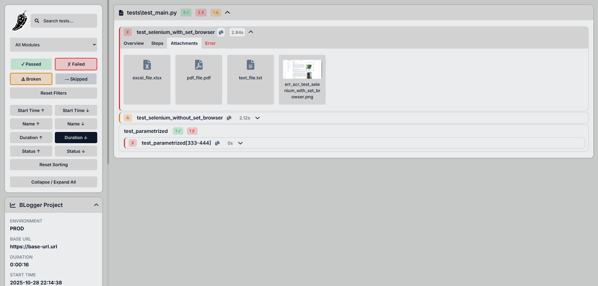
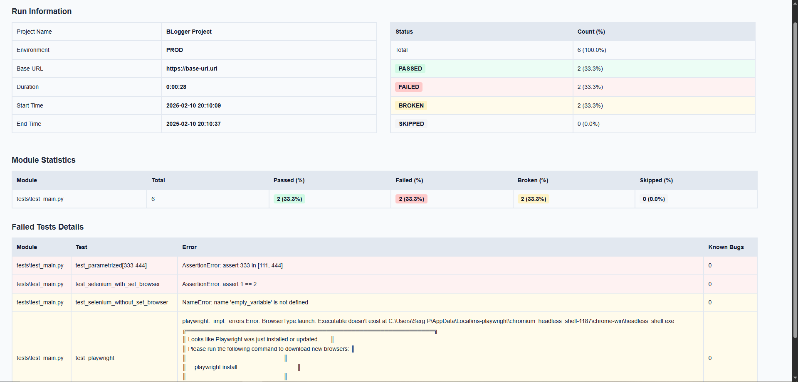

# BLogger — Pytest Logging Plugin

- [Описание](#описание)
- [Примеры отчетов](#примеры-отчетов)
- [Установка](#установка)
- [Настройка](#настройка)
  - [Project Name](#project_name)
  - [Time Zone](#timezone)
  - [Integrations](#integrations)
  - [Hide Passwords](#hide_passwords)
  - [Env and Base URL](#env-and-base_url)
- [BLogger API](#blogger-api)
  - [Set Base URL](#set-base-url)
  - [Set Env](#set-env)
  - [Set Browser](#set-browser)
  - [Description](#description)
  - [Info](#info)
  - [Link](#link)
  - [Known Bug](#known-bug)
  - [Step](#step)
  - [Print](#print)
  - [Screenshot](#screenshot)
  - [Attach](#attach)
- [Публикация в CI/CD](#публикация-в-cicd)
  - [Jenkins](#jenkins)
- [Полезные фичи](#полезные-фичи)
  - [Notes](#notes)
  - [Search, Filters and Sorting](#search-filters-and-sorting)
  - [Compare Retries](#compare-retries)
  - [Automatic Error Screenshots](#automatic-error-screenshots)
---


## Описание

BLogger — это плагин Pytest для улучшенного логирования тестов и создания удобных и лёгких HTML-отчётов.  
Он поддерживает структурированные шаги тестов, описания, информационные заметки, Known Bugs и автоматические скриншоты.  
Отлично работает как с Selenium WebDriver, так и с Playwright Page.  
Интегрируется с Allure и Qase, что уменьшает дублирование сущностей вроде .steps, .attach и т. д.

---


## Примеры отчетов

### b_logs
[Скачать sample_b_logs.zip](readme_content/sample_b_logs.zip)

### blog_report.html
Нажмите на главный значок (перчик), чтобы переключать темы оформления.




### blog_summary.html


---


## Установка

```bash
pip install pytest-b-logger
```
---


## Настройка
!!! Добавьте файл ***blog.config.yaml*** в ***корень*** вашего проекта. !!!

### project_name
Минимальная настройка, необходимая для работы плагина: 
```yaml
project_name: 'Project Name'
```
Имя проекта можно изменить через CLI при запуске тестов:
```bash
pytest --blog-project-name '...'
```


### timezone
Укажите желаемый часовой пояс в формате IANA (например: Europe/Moscow, UTC, America/New_York). \
Список доступных часовых поясов: https://en.wikipedia.org/wiki/List_of_tz_database_time_zones

```yaml
project_name: 'Project Name'

tz: 'Europe/Moscow'
```


### integrations
По умолчанию интеграции отключены. \
Если вы используете Allure и хотите дублировать шаги, info, description и другие данные в Allure, \
добавьте блок: ***integrations: allure: True***
```yaml
project_name: 'Project Name'

tz: 'Europe/Moscow'

integrations:
  allure: True
```


### hide_passwords
По умолчанию пароли внутри параметров скрыты.


Чтобы отображать пароли, установите: ***hide_passwords: False***
```yaml
project_name: 'Project Name'

tz: 'Europe/Moscow'

integrations:
  allure: True

hide_passwords: False
```


### env and base_url
Вы можете указать окружение и базовый URL
```yaml
project_name: 'Project Name'

tz: 'Europe/Moscow'

integrations:
  allure: True

hide_passwords: True

env: 'prod' # optional
base_url: 'https://base-url.com' # optional
```
Также их можно передавать через CLI (например, в CI/CD):
```bash
pytest --blog-env 'prod' --blog-base-url 'https://base-url.com'
```

***!!! Важно !!!***
Параметры применяются в следующем порядке:
blog.config.yaml → CLI аргументы → методы blog внутри тестов

Теперь настройка завершена.
При запуске pytest автоматически появится папка b_logs
с файлами blog_report.html и blog_summary.html.

Для расширенного использования смотрите раздел ***[BLogger API](#blogger-api)***

---


## BLogger API


### Set Base URL
`blog.set_base_url(base_url: str)`

Устанавливает `base_url` для всего прогона.
```python
from b_logger import blog

blog.set_base_url('https://base-url.com')
```

Можно также указать в blog.config.yaml:
```yaml
base_url: 'https://base-url.com'
```

Или передать через CLI:
```bash
pytest --blog-base-url 'https://base-url.com'
```
---


### Set Env
`blog.set_env(env: str)`

Устанавливает `env` для всего прогона.
```python
from b_logger import blog

blog.set_env('env')
```

Можно также указать в blog.config.yaml:
```yaml
env: 'prod'
```

Или передать через CLI:
```bash
pytest --blog_env 'prod'
```
---


### Set Browser
`set_browser(browser: "RemoteWebDriver | WebDriver | Page")`

Устанавливает экземпляр браузера внутри фикстуры или в самом тесте.

Если имя фикстуры совпадает с одним из: "driver", "page", "selenium_driver", "driver_init", "playwright_page" \
то BLogger автоматически определит и применит браузер.

При установленном браузере плагин автоматически делает скриншоты ошибок и прикрепляет их к шагам и error info.
```python
import pytest
from selenium import webdriver
from b_logger import blog

@pytest.fixture()
def selenium_driver():
    driver = webdriver.Chrome()

    blog.set_browser(driver)  # <-- Manual browser instance setup

    yield driver

    driver.quit()
```
or
```python
def test_playwright(page):  # <-- Will be detected automatically
    ...
```
---


### Description
`description(description: str)`

Добавляет описание теста. \
Будет отображено во вкладке Overview.

Может использоваться как декоратор @blog.description() или как вызов внутри теста blog.description()
```python
from b_logger import blog

@blog.description(
    'Test with base functionality, '
    'this description can be modified inside the test'
)
def test_main_functionality():
    blog.description('This description will also be added')
```
---


### Info
`info(**kwargs)`

Добавляет информационные блоки о тесте или шаге. \
Отображаются во вкладке Overview и внутри текущего шага.

Можно использовать как декоратор @blog.info() или как вызов внутри теста.

k: имя блока \
v: поддерживает любой тип данных (лучше всего читаются dict)

Можно передавать множество блоков: @blog.info(k=v, k=v, k=v, ...)

```python
from b_logger import blog

@blog.info(
    meta={'platform': 'linux', 'python_version': 3.12},
    additional_parameters=['param 1', 'param 2'],
    some_info='some info'
)
def test_main_functionality():
    blog.info(a='a')
    
    with blog.step('Step 1'):
        blog.info(
            step_1_info={'b': 2, 'c': 3}
        )
```
---


### Link
`link(**kwargs)`

Добавляет ссылки к тесту или шагу. \
Отображаются во вкладке Overview и внутри текущего шага.

Can be used as marker @blog.link(k=v) as well as function blog.link(k=v)

k: название ссылки \
v: URL

Можно добавлять любое количество: @blog.link(k=v, k=v, k=v, ...)

```python
from b_logger import blog

@blog.link(
    first_link='http://aaa.com',
    second_link='http://bbb.com'
)
def test_main_functionality():
    blog.link(third_link='http://ccc.com')
```
---


### Known Bug
`known_bug(url: str, description: str)`

Добавляет известную ошибку для теста или шага. \
Отображается в Overview и внутри текущего шага.

```python
from b_logger import blog

@blog.known_bug(
    'https://link-to-your-bug/1.com',
    'Test Bug 1'
)
def test_main_functionality():
    blog.known_bug(description='Test Bug 2')

    with blog.step('Step Title'):
        blog.known_bug('https://link-to-your-bug/3.com')
```
---


### Step
`step(title: str, expected: str = None)`

Оформляет блок кода как шаг теста. \
Будет отображён в Setup, Steps или Teardown в зависимости от стадии выполнения.

Всё, что вызвано внутри step (info, bugs, links, prints, attach, screenshot), прикрепляется к текущему шагу.
```python
from b_logger import blog

with blog.step('Step Title', 'Expected Result'):
    ...
```
---


### Print
`print(data)`

Логирует любое сообщение (str, dict, list, object, etc.) \
Отображается внутри шага и сохраняется в stdout.txt.

```python
from b_logger import blog

data = {"a": 1, "b": 2}
blog.print(f'Some important data: {data}')

blog.print(f'Probably too long str\n'
            'can be newlined like that')
```
---


### Screenshot
`screenshot(name: str = None, is_error: bool = False)`

Делает скриншот. \
Добавляется на вкладку Attachments и в текущий шаг.

Если браузер не установлен — ничего не делает.

is_error=True добавляет префикс err_scr_.

```python
from b_logger import blog

blog.screenshot('scr_name')
blog.screenshot('err_scr_name', True)
```
---


### Attach
`attach(content: Union[bytes, Path, BinaryIO, str, dict, list, int, float, bool, None], name: str = None)`

Прикрепляет файл или данные. \
Добавляется на вкладку Attachments и в текущий шаг.

Чтобы сохранить данные как определённый тип, укажите расширение имени файла. Например: 'excel_file.xlsx'

```python
from b_logger import blog
from pathlib import Path

blog.attach({"a": 1, "b": 2}, 'some_data')
blog.attach(Path('path/to/your/file.ext'))
blog.attach(excel_data, 'excel_file.xlsx')
```
---


## Usage examples


## Публикация в CI/CD
### Jenkins
Чтобы опубликовать отчёт в Jenkins, можно использовать HTML Publisher.

В ***pipeline script*** или ***Jenkinsfile*** добавьте команду:
```
publishHTML([
    reportName: 'BLog Report',
    reportDir: 'b_logs',
    reportFiles: 'blog_report.html',
    icon: 'static/icon.svg',
    allowMissing: false,
    keepAll: true,
    alwaysLinkToLastBuild: true
])
```
Однако, вы можете столкнуться с проблемой CSP (Content Security Policy), блокирующей загрузку .js и .css.  
Чтобы избежать изменения CSP, можно настроить **Resource Root URL**:  
https://www.jenkins.io/doc/book/security/user-content/#resource-root-url

После этого отчёт будет доступен по адресу вида: `https://jenkins.../job/.../BLog_20Report/`

Также можно сохранять папку **b_logs** как артефакт сборки:
```
archiveArtifacts artifacts: 'b_logs/**', fingerprint: true, allowEmptyArchive: true
zip zipFile: 'b_logs.zip', archive: true, dir: 'b_logs/'
```
---


## Полезные фичи

### Notes
Добавьте файл ***blog.notes.yaml*** в ***корень проекта***.

В него можно добавить блок ***style***, чтобы оформить заметки в blog_summary.html. \
Поддерживаются простые CSS-свойства: цвет, размер шрифта и т. д.
```yaml
style: # optional
  color: red
  font-size: 20px

notes:
  - 'Here you can add any useful info about project'
  - 'For example floating bugs or specifications'
  - 'These notes will appear in blog_report.html and blog_summary.html'
```
Результат:

blog_summary.html


blog_report.html

___


### Search, Filters and Sorting

___


### Compare Retries

___


### Automatic Error Screenshots


___